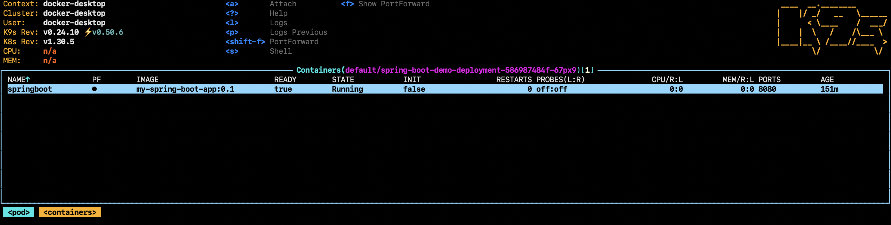
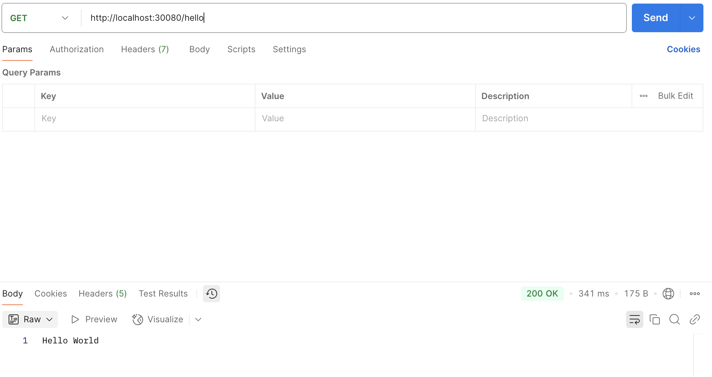
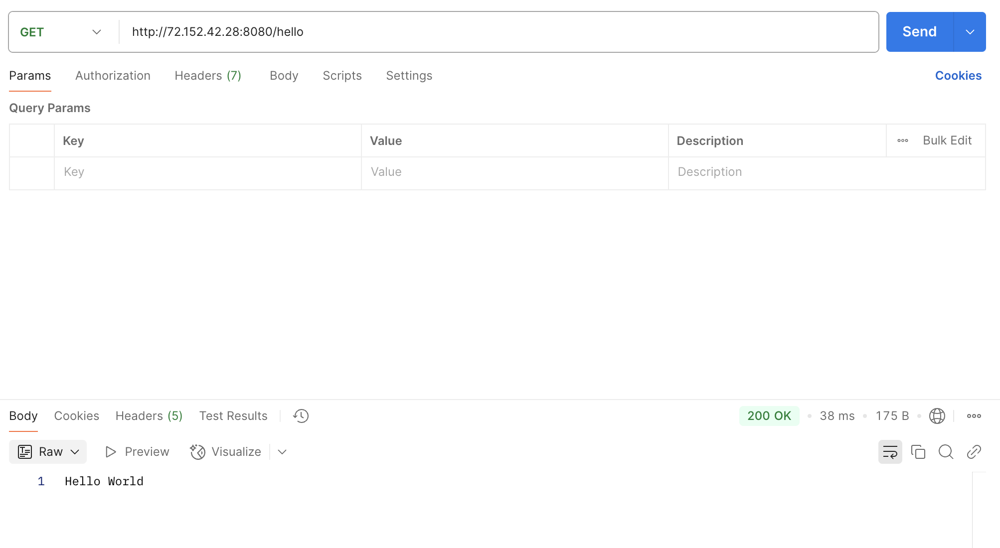
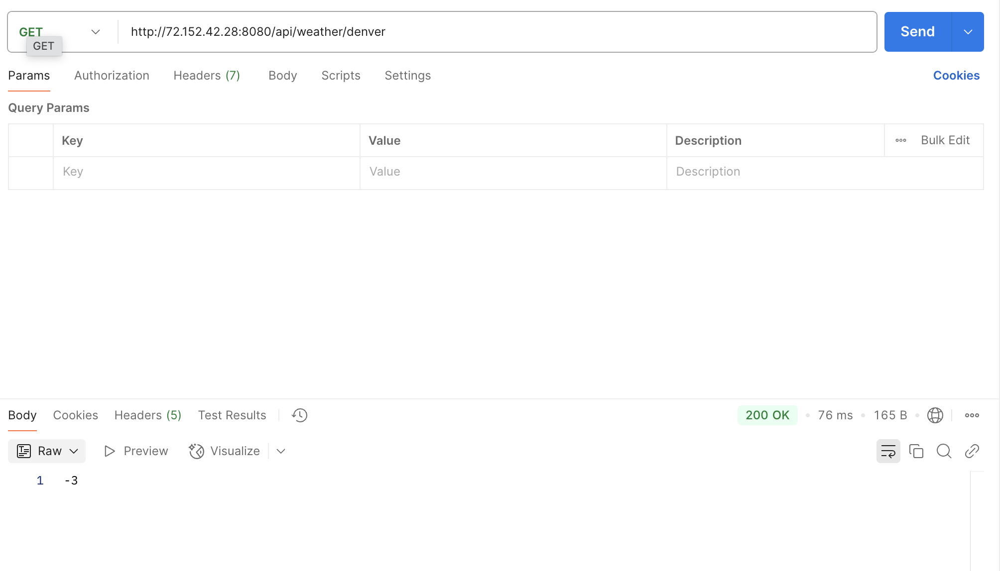

# Spring boot application with helm chart
It is a simple spring boot application with two apis
## Run local using CLI
- Greet API `/hello` which return a `Hello World`.
- Weather API `/api/weather/{city}` which return the temperature of that city.
- Navigate to demo in terminal and run `mvn spring-boot:run`
- Then hit `http://localhost:8080/hello` and `http://localhost:8080/api/weather/dallas` for Greet API and Weather API
## Local using docker image and Helm chart.
### Development 
- Using docker file create a docker image `docker build -t my-spring-boot-app:0.1 . `
- Crete a helm chart by running `helm create springboot-chart` it will create a `springboot-chart` helm chart folder
- Do the following changes
#### deployment.yaml
```shell
apiVersion: apps/v1
kind: Deployment
metadata:
  name: {{ .Release.Name }}-deployment
spec:
  replicas: {{ .Values.replicaCount }}
  selector:
    matchLabels:
      app: {{ .Release.Name }}
  template:
    metadata:
      labels:
        app: {{ .Release.Name }}
    spec:
      containers:
        - name: springboot
          image: "{{ .Values.image.repository }}:{{ .Values.image.tag }}"
          imagePullPolicy: {{ .Values.image.pullPolicy }}
          ports:
            - containerPort: 8080


```
#### service.yaml
```shell
apiVersion: v1
kind: Service
metadata:
  name: {{ .Release.Name }}-service
spec:
  type: {{ .Values.service.type }}
  selector:
    app: {{ .Release.Name }}
  ports:
    - port: 8080
      targetPort: 8080
      nodePort: {{ .Values.service.nodePort | default 30080 }}

```
#### values.yaml
```shell
replicaCount: 1

image:
  repository: my-spring-boot-app
  tag: 0.1
  pullPolicy: Never  # Change to IfNotPresent or Always if needed

service:
  type: NodePort
  nodePort: 30080
```
### Deployment
```shell
$ kubectl config get-contexts ## to get the kubectl contexts
CURRENT   NAME             CLUSTER          AUTHINFO                                   NAMESPACE
          docker-desktop   docker-desktop   docker-desktop                             
          minikube         minikube         minikube                                   default
*         springboot-aks   springboot-aks   clusterUser_spring-aks-rg_springboot-aks

$ kubectl config set current-context docker-desktop. ## Switch to docker-desktop   

$ kubectl config get-contexts                               
CURRENT   NAME             CLUSTER          AUTHINFO                                   NAMESPACE
*         docker-desktop   docker-desktop   docker-desktop                             
          minikube         minikube         minikube                                   default
          springboot-aks   springboot-aks   clusterUser_spring-aks-rg_springboot-aks 
          
$ helm install spring-boot-demo ./springboot-chart    ## spring-boot-demo is name of the helm 

$ helm list                                           
NAME            	NAMESPACE	REVISION	UPDATED                             	STATUS  	CHART                 	APP VERSION
spring-boot-demo	default  	1       	2025-05-29 17:56:21.343103 -0500 CDT	deployed	springboot-chart-0.1.0	1.16.0  

$ kubectl get pods                                          
NAME                                           READY   STATUS    RESTARTS   AGE
spring-boot-demo-deployment-586987484f-67px9   1/1     Running   0          23m  
      
$ kubectl logs spring-boot-demo-deployment-586987484f-67px9 
2025-05-29T22:56:24.034Z  INFO 1 --- [demo] [           main] com.example.demo.DemoApplication         : Starting DemoApplication v0.0.1-SNAPSHOT using Java 17.0.15 with PID 1 (/demo.jar started by root in /)
2025-05-29T22:56:24.036Z  INFO 1 --- [demo] [           main] com.example.demo.DemoApplication         : No active profile set, falling back to 1 default profile: "default"
2025-05-29T22:56:24.683Z  INFO 1 --- [demo] [           main] o.s.b.w.embedded.tomcat.TomcatWebServer  : Tomcat initialized with port 8080 (http)
2025-05-29T22:56:24.689Z  INFO 1 --- [demo] [           main] o.apache.catalina.core.StandardService   : Starting service [Tomcat]
2025-05-29T22:56:24.689Z  INFO 1 --- [demo] [           main] o.apache.catalina.core.StandardEngine    : Starting Servlet engine: [Apache Tomcat/10.1.41]
2025-05-29T22:56:24.710Z  INFO 1 --- [demo] [           main] o.a.c.c.C.[Tomcat].[localhost].[/]       : Initializing Spring embedded WebApplicationContext
2025-05-29T22:56:24.711Z  INFO 1 --- [demo] [           main] w.s.c.ServletWebServerApplicationContext : Root WebApplicationContext: initialization completed in 619 ms
2025-05-29T22:56:24.986Z  INFO 1 --- [demo] [           main] o.s.b.w.embedded.tomcat.TomcatWebServer  : Tomcat started on port 8080 (http) with context path '/'
2025-05-29T22:56:24.994Z  INFO 1 --- [demo] [           main] com.example.demo.DemoApplication         : Started DemoApplication in 1.293 seconds (process running for 1.905)
2025-05-29T22:57:57.739Z  INFO 1 --- [demo] [nio-8080-exec-2] o.a.c.c.C.[Tomcat].[localhost].[/]       : Initializing Spring DispatcherServlet 'dispatcherServlet'
2025-05-29T22:57:57.749Z  INFO 1 --- [demo] [nio-8080-exec-2] o.s.web.servlet.DispatcherServlet        : Initializing Servlet 'dispatcherServlet'
2025-05-29T22:57:57.766Z  INFO 1 --- [demo] [nio-8080-exec-2] o.s.web.servlet.DispatcherServlet        : Completed initialization in 17 ms

$ kubectl get svc                                           
NAME                       TYPE        CLUSTER-IP      EXTERNAL-IP   PORT(S)          AGE
kubernetes                 ClusterIP   10.96.0.1       <none>        443/TCP          28h
spring-boot-demo-service   NodePort    10.102.125.56   <none>        8080:30080/TCP   25m
```
#### K9s


### Testing
- Output in postman 
  - Greet API call
     
  - Weather API call
     
#### Other useful commands
```shell
$ helm list      
NAME            	NAMESPACE	REVISION	UPDATED                             	STATUS  	CHART                 	APP VERSION
spring-boot-demo	default  	1       	2025-05-29 17:56:21.343103 -0500 CDT	deployed	springboot-chart-0.1.0	1.16.0     

$ helm uninstall spring-boot-demo  
release "spring-boot-demo" uninstalled

$ helm list                      
NAME	NAMESPACE	REVISION	UPDATED	STATUS	CHART	APP VERSION

```
## Deploy in Kubernetes service using docker image from Docker hub and helm chart 
### Prerequisites
1. [Install Azure CLI](https://learn.microsoft.com/en-us/cli/azure/install-azure-cli?view=azure-cli-latest)
2. [Install kubectl](https://learn.microsoft.com/en-us/cli/azure/aks?view=azure-cli-latest#az-aks-install-cli)
### Create a docker image and push it to docker hub 
```
docker buildx create --use   # only once, to enable buildx
docker buildx build --platform linux/amd64,linux/arm64 -t <your-docker-hub>/my-spring-boot-app:0.4 --push .
```
#### deployment.yaml
```shell
apiVersion: apps/v1
kind: Deployment
metadata:
  name: {{ .Release.Name }}-deployment
spec:
  replicas: {{ .Values.replicaCount }}
  selector:
    matchLabels:
      app: {{ .Release.Name }}
  template:
    metadata:
      labels:
        app: {{ .Release.Name }}
    spec:
      containers:
        - name: springboot
          image: "{{ .Values.image.repository }}:{{ .Values.image.tag }}"
          imagePullPolicy: {{ .Values.image.pullPolicy }}
          ports:
            - containerPort: 8080


```
#### service.yaml
```shell
apiVersion: v1
kind: Service
metadata:
  name: {{ .Release.Name }}-service
spec:
  type: {{ .Values.service.type }}
  selector:
    app: {{ .Release.Name }}
  ports:
    - port: 8080
      targetPort: 8080
      nodePort: {{ .Values.service.nodePort | default 30080 }}

```
#### values.yaml
```shell
##Azure Kubernetes service
replicaCount: 1

image:
  repository: {your-docker-hub}/{image}. # make sure to replace it
  tag: {tag}
  pullPolicy: Always

service:
  type: LoadBalancer
  port: 80
  targetPort: 8080
```
 
 
### Create a kubernetes service 
- search for Azure Kubernetes Service (AKS)
- click on create.
- continue steps based on your preference
### Connect azure cluster from local
- Open Azure Kubernetes Service (AKS) you just created
- start the service by clicking on `start`
- click on connect
- copy the value of Download cluster credentials
- `az aks get-credentials --resource-group <resource-group> --name <cluster-name> --overwrite-existing`
- Run the above command in a terminal like below
```shell
$ az aks get-credentials --resource-group <resource-group> --name <cluster-name> --overwrite-existing

$ kubectl config current-context                                                                  
springboot-aks

$ kubectl config get-contexts # to list all the clusters in your local
CURRENT   NAME             CLUSTER          AUTHINFO                                   NAMESPACE
          docker-desktop   docker-desktop   docker-desktop                             
          minikube         minikube         minikube                                   default
*         springboot-aks   springboot-aks   clusterUser_spring-aks-rg_springboot-aks

$ helm install spring-boot-demo-azure ./springboot-chart 
NAME: spring-boot-demo-azure
LAST DEPLOYED: Thu May 29 21:46:50 2025
NAMESPACE: default
STATUS: deployed
REVISION: 1
TEST SUITE: None
NOTES:
1. Get the application URL by running these commands:

$ helm list
NAME                  	NAMESPACE	REVISION	UPDATED                             	STATUS  	CHART                 	APP VERSION
spring-boot-demo-azure	default  	1       	2025-05-29 21:46:50.960661 -0500 CDT	deployed	springboot-chart-0.1.0	1.16.0     
 
$ kubectl get pods
NAME                                                 READY   STATUS    RESTARTS   AGE
spring-boot-demo-azure-deployment-66cc8fc489-7qqnd   1/1     Running   0          2m41s

$ kubectl get svc
NAME                             TYPE           CLUSTER-IP     EXTERNAL-IP    PORT(S)          AGE
kubernetes                       ClusterIP      10.0.0.1       <none>         443/TCP          2d7h
spring-boot-demo-azure-service   LoadBalancer   10.0.195.186   72.152.42.28   8080:30080/TCP   2m54s

$ kubectl logs spring-boot-demo-azure-deployment-66cc8fc489-7qqnd
 :: Spring Boot ::                (v3.4.6)

2025-05-30T02:46:53.556Z  INFO 1 --- [demo] [           main] com.example.demo.DemoApplication         : Starting DemoApplication v0.0.1-SNAPSHOT using Java 17.0.15 with PID 1 (/demo.jar started by root in /)
2025-05-30T02:46:53.568Z  INFO 1 --- [demo] [           main] com.example.demo.DemoApplication         : No active profile set, falling back to 1 default profile: "default"
2025-05-30T02:46:54.915Z  INFO 1 --- [demo] [           main] o.s.b.w.embedded.tomcat.TomcatWebServer  : Tomcat initialized with port 8080 (http)
2025-05-30T02:46:54.933Z  INFO 1 --- [demo] [           main] o.apache.catalina.core.StandardService   : Starting service [Tomcat]
2025-05-30T02:46:54.934Z  INFO 1 --- [demo] [           main] o.apache.catalina.core.StandardEngine    : Starting Servlet engine: [Apache Tomcat/10.1.41]
2025-05-30T02:46:55.030Z  INFO 1 --- [demo] [           main] o.a.c.c.C.[Tomcat].[localhost].[/]       : Initializing Spring embedded WebApplicationContext
2025-05-30T02:46:55.031Z  INFO 1 --- [demo] [           main] w.s.c.ServletWebServerApplicationContext : Root WebApplicationContext: initialization completed in 1383 ms
2025-05-30T02:46:55.477Z  INFO 1 --- [demo] [           main] o.s.b.w.embedded.tomcat.TomcatWebServer  : Tomcat started on port 8080 (http) with context path '/'
2025-05-30T02:46:55.491Z  INFO 1 --- [demo] [           main] com.example.demo.DemoApplication         : Started DemoApplication in 2.539 seconds (process running for 3.109)
 
$ curl http://72.152.42.28:8080/hello
Hello World% 

$ curl http://72.152.42.28:8080/api/weather/denver 
-3%    
                                                                                                                                                                             
```
### Testing
- Output in postman
    - Greet API call
      
    - Weather API call
      
#### Other useful commands
```shell
$ helm list
NAME                  	NAMESPACE	REVISION	UPDATED                             	STATUS  	CHART                 	APP VERSION
spring-boot-demo-azure	default  	1       	2025-05-29 21:46:50.960661 -0500 CDT	deployed	springboot-chart-0.1.0	1.16.0     
 
$ helm uninstall spring-boot-demo-azure
release "spring-boot-demo-azure" uninstalled

$ helm list                            
NAME	NAMESPACE	REVISION	UPDATED	STATUS	CHART	APP VERSION
```
## Deploy in Kubernetes service using docker image from Azure Container registry and helm chart
### Create an Azure Container registry
#### Using Azure portal
1. Go to  [Azure Portal](https://portal.azure.com/#home)  and sign in.
2. In the left sidebar, click on "Container registries".
3. Select create button.
4. Then provide the required details based on your preference.
5. Click on Review + create
#### Using Azure CLI
```shell
$ az login
$ az group create --name spring-demo --location eastus # az group create --name <resource-group-name> --location <location>
$ az acr create --resource-group spring-demo \
              --name springdemoacr \  # Resource names may contain alpha numeric characters only and must be between 5 and 50 characters
              --sku Basic \. # --sku options: Basic, Standard, Premium
              --admin-enabled true
$ az acr show --name springdemoacr --resource-group spring-demo
$ az acr list --output table
$ az acr login --name springdemoacr # az acr login --name <your-acr-name>
# Navigate to docker image location. 
$ docker buildx build \            
  --platform linux/amd64,linux/arm64 \
  -t  springdemoacr.azurecr.io/my-spring-boot-app:0.1 \
  --push . 
# list the repositories 
$ az acr repository list  --name springdemoacr 

[
  "my-spring-boot-app"
]
$ az acr repository show-tags --name springdemoacr --repository my-spring-boot-app

[
  "0.1"
]

$ az acr credential show --name springdemoacr # To get the password
$ kubectl delete secret acr-auth # if you already have a secret 
# If you're using Azure Kubernetes Service (AKS) and your ACR is in the same subscription and resource group, you can link them like this:
$ az aks update \
  --name <aks-cluster-name> \
  --resource-group <resource-group-name> \
  --attach-acr <acr-name>

# Create a Kubernetes ImagePullSecret (manual) If you're not using AKS or ACR is in a different subscription, you can create a secret manually:  
$ kubectl create secret docker-registry acr-auth \
  --docker-server=<your-server-name.azurecr.io> \
  --docker-username=<your-acr-username> \
  --docker-password=<your-acr-password> \
  --docker-email=<your-email>
 
```

#### deployment.yaml
```shell
apiVersion: apps/v1
kind: Deployment
metadata:
  name: {{ .Release.Name }}-deployment
spec:
  replicas: {{ .Values.replicaCount }}
  selector:
    matchLabels:
      app: {{ .Release.Name }}
  template:
    metadata:
      labels:
        app: {{ .Release.Name }}
    spec:
      imagePullSecrets:
        - name: acr-auth
      containers:
        - name: springboot
          image: "{{ .Values.image.repository }}:{{ .Values.image.tag }}"
          imagePullPolicy: {{ .Values.image.pullPolicy }}
          ports:
            - containerPort: 8080
```
 
#### values.yaml
```shell
##Azure Kubernetes service with Container registry
replicaCount: 1

image:
  repository: springdemoacr.azurecr.io/my-spring-boot-app
  tag: 0.1
  pullPolicy: Always

service:
  type: LoadBalancer
  port: 80
  targetPort: 8080
```
 
```shell
# Navigate to you azure portal and open Kubernetes service then click on connect 
$ az aks get-credentials --resource-group <resource-group> --name <cluster-name> --overwrite-existing

$ kubectl config current-context                                                                  
springboot-aks

$ kubectl config get-contexts # to list all the clusters in your local
CURRENT   NAME             CLUSTER          AUTHINFO                                   NAMESPACE
          docker-desktop   docker-desktop   docker-desktop                             
          minikube         minikube         minikube                                   default
*         springboot-aks   springboot-aks   clusterUser_spring-aks-rg_springboot-aks

$ helm install spring-boot-demo-azure ./springboot-chart
NAME: spring-boot-demo-azure
LAST DEPLOYED: Sat May 31 18:05:38 2025
NAMESPACE: default
STATUS: deployed
REVISION: 1
TEST SUITE: None
NOTES:
1. Get the application URL by running these commands: 

$ kubectl get pods
NAME                                                 READY   STATUS              RESTARTS   AGE
spring-boot-demo-azure-deployment-78c4559bc7-pwpgf   0/1     ContainerCreating   0          13s

$ kubectl get svc
NAME                             TYPE           CLUSTER-IP   EXTERNAL-IP      PORT(S)          AGE
kubernetes                       ClusterIP      10.0.0.1     <none>           443/TCP          4d3h
spring-boot-demo-azure-service   LoadBalancer   10.0.66.12   <EXTERNAL-IP>   8080:30080/TCP   27s

$ kubectl get pods
NAME                                                 READY   STATUS    RESTARTS   AGE
spring-boot-demo-azure-deployment-78c4559bc7-pwpgf   1/1     Running   0          35s
$ kubectl logs spring-boot-demo-azure-deployment-78c4559bc7-pwpgf
2025-05-31T23:05:53.108Z  INFO 1 --- [demo] [           main] com.example.demo.DemoApplication         : Starting DemoApplication v0.0.1-SNAPSHOT using Java 17.0.15 with PID 1 (/demo.jar started by root in /)
2025-05-31T23:05:53.126Z  INFO 1 --- [demo] [           main] com.example.demo.DemoApplication         : No active profile set, falling back to 1 default profile: "default"
2025-05-31T23:05:54.515Z  INFO 1 --- [demo] [           main] o.s.b.w.embedded.tomcat.TomcatWebServer  : Tomcat initialized with port 8080 (http)
2025-05-31T23:05:54.529Z  INFO 1 --- [demo] [           main] o.apache.catalina.core.StandardService   : Starting service [Tomcat]
2025-05-31T23:05:54.530Z  INFO 1 --- [demo] [           main] o.apache.catalina.core.StandardEngine    : Starting Servlet engine: [Apache Tomcat/10.1.41]
2025-05-31T23:05:54.568Z  INFO 1 --- [demo] [           main] o.a.c.c.C.[Tomcat].[localhost].[/]       : Initializing Spring embedded WebApplicationContext
2025-05-31T23:05:54.569Z  INFO 1 --- [demo] [           main] w.s.c.ServletWebServerApplicationContext : Root WebApplicationContext: initialization completed in 1283 ms
2025-05-31T23:05:55.114Z  INFO 1 --- [demo] [           main] o.s.b.w.embedded.tomcat.TomcatWebServer  : Tomcat started on port 8080 (http) with context path '/'
2025-05-31T23:05:55.136Z  INFO 1 --- [demo] [           main] com.example.demo.DemoApplication         : Started DemoApplication in 2.698 seconds (process running for 3.357)
$ curl http://<EXTERNAL-IP>/hello
Hello World%                                                                                                                                                                      
```

#### Other useful commands
```shell
$ helm uninstall spring-boot-demo-azure
release "spring-boot-demo-azure" uninstalled

$ helm list                            
NAME	NAMESPACE	REVISION	UPDATED	STATUS	CHART	APP VERSION
```

## Using GitHub Action
### You can use multiple ways to do the GitHub actions. Here I am using ACR Username, Password and kubeconfig. 
- Step 1: Get ACR Username and Password
  - Go to Azure Portal → Your ACR (e.g., springdemoacr)
  - Navigate to Access keys under Settings
  - Enable Admin user (if not already enabled)
  - Copy: Username Password (either password1 or password2)
  - Or you can use CLI  by running below commands 
  ```shell
    az acr credential show --name <azure-container-registry>
   ``` 
  - Generate AKS kubeconfig Locally.
  ```shell
        $ az aks get-credentials --resource-group spring-demo --name your-aks-cluster-name --file kubeconfig
        $ base64 -w 0 kubeconfig > kubeconfig.b64 # windows
        $ base64 -i kubeconfig -o kubeconfig.b64 # mac
  ```
- Step 2: Add GitHub Secrets
  - In your GitHub repo: Go to Settings → Secrets → Actions
  - Add the following secrets:
    - ACR_USERNAME → (paste the username)
    - ACR_PASSWORD → (paste the password)
    - ACR_LOGIN_SERVER → (e.g., springdemoacr.azurecr.io)
    - KUBECONFIG_B64 -> (kubeconfig.b64)

 ### Add below code to  .github/workflows/docker-to-acr.yaml
```shell
name: Build and Push Docker Image to ACR with Username/Password

on:
  push:
    branches: [ main ]

jobs:
  build-push-deploy:
    runs-on: ubuntu-latest

    steps:
      - name: Checkout Code
        uses: actions/checkout@v3

      - name: Generate IMAGE_TAG
        id: tag
        run: echo "tag=$(date +%Y%m%d%H%M%S)" >> $GITHUB_OUTPUT

      - name: Set environment variables
        run: |
          echo "IMAGE_NAME=springapp" >> $GITHUB_ENV
          echo "IMAGE_TAG=${{ steps.tag.outputs.tag }}" >> $GITHUB_ENV
          echo "ACR_LOGIN_SERVER=springdemoacr.azurecr.io" >> $GITHUB_ENV
          echo "HELM_RELEASE_NAME=springapp-release" >> $GITHUB_ENV
          echo "HELM_CHART_PATH=./charts/springapp" >> $GITHUB_ENV

      - name: Build Spring Boot app
        run: mvn clean install -DskipTests

      - name: Docker login to ACR
        run: echo "${{ secrets.ACR_PASSWORD }}" | docker login $ACR_LOGIN_SERVER --username ${{ secrets.ACR_USERNAME }} --password-stdin

      - name: Build Docker image
        run: docker build -t $IMAGE_NAME:$IMAGE_TAG .

      - name: Tag Docker image for ACR
        run: docker tag $IMAGE_NAME:$IMAGE_TAG $ACR_LOGIN_SERVER/$IMAGE_NAME:$IMAGE_TAG

      - name: Push Docker image to ACR
        run: docker push $ACR_LOGIN_SERVER/$IMAGE_NAME:$IMAGE_TAG

      - name: Install Helm
        run: curl https://raw.githubusercontent.com/helm/helm/main/scripts/get-helm-3 | bash

      - name: Deploy using Helm
        run: |
          echo "${{ secrets.KUBECONFIG_B64 }}" | base64 -d > kubeconfig
          export KUBECONFIG=$(pwd)/kubeconfig
          helm upgrade --install $HELM_RELEASE_NAME $HELM_CHART_PATH \
            --set image.repository=$ACR_LOGIN_SERVER/$IMAGE_NAME \
            --set image.tag=$IMAGE_TAG
```